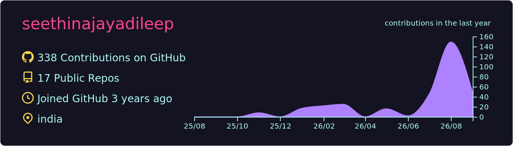
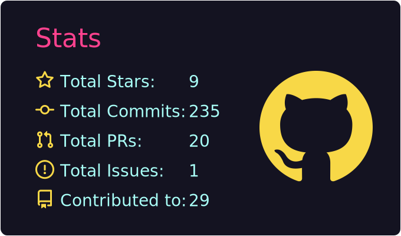
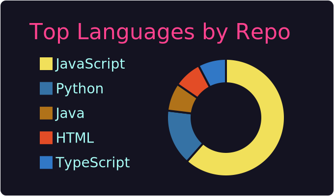
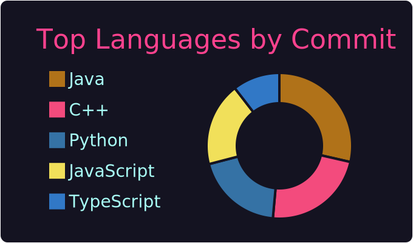
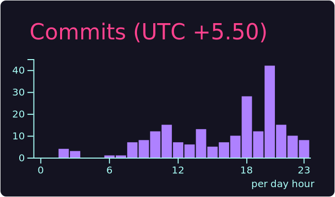

# Jaya Dileep

Full-stack engineer building AI agents, automation, and test systems.

[Portfolio](https://www.seethinajayadileep.dev/) · [LinkedIn](https://www.linkedin.com/in/jaya-dileep-seethina/) · [Email](mailto:seethinajayadileep@hotmail.com)

 

## Featured work

| Project | What it is |
| --- | --- |
| **[AgentOps CRM](https://github.com/seethinajayadileep/AgentOps-CRM)** | Spring Boot + React CRM with Firecrawl RAG, lead capture, Apify prospecting, Vapi voice. [Live](https://agent-ops-crm.vercel.app/). |
| **[EquityLens AI](https://github.com/seethinajayadileep/equitylens-ai)** | LangGraph.js multi-agent equity research. Five specialist LLMs plus a Chief Analyst, live market data, SSE to React. |
| **[Scout (JobScraper)](https://github.com/seethinajayadileep/JobScraper)** | Next.js + Express job discovery with OpenAI ranking, Apify, Redis/Postgres, Docker, Telegram digest. |
| **[PII Redaction Tool](https://github.com/seethinajayadileep/PII-Redaction-Tool-Scaler-AI-Labs)** | FastAPI + CLI redactor for PDF/DOCX/OCR. Docker, Railway, Vercel. |
| **[AI Exam Evaluation](https://github.com/seethinajayadileep/AI-Exam-Evaluation-System)** | React + Node NLP grader for long-form answers. |

## Open source

PRs on other people's repos, not mine.

| Project | Status | What |
| --- | --- | --- |
| [SeleniumHQ/selenium](https://github.com/SeleniumHQ/selenium/pulls?q=is%3Apr+author%3Aseethinajayadileep) | 6 merged, [1 open](https://github.com/SeleniumHQ/selenium/pull/17177) | Java bindings: Keys, Platform NPE, screenshot errors, JSON number overflow, ScriptKey, InstanceCoercer |
| [appium/java-client#2441](https://github.com/appium/java-client/pull/2441) | merged | Validate `RemoteWebElement` in `ElementOption.withElement` |
| [streamshub/console#2867](https://github.com/streamshub/console/pull/2867) | merged | Kafka console: ignore Apicurio 3 split packages in Quarkus ARC |
| [awaitility/awaitility#313](https://github.com/awaitility/awaitility/pull/313) | open | Fix Predicate never tested when Callable returns null |
| [wiremock/wiremock#3576](https://github.com/wiremock/wiremock/pull/3576) | open | Accept `YYYY-MM-DD` for Admin API `since` query param |
| [rest-assured/rest-assured#1886](https://github.com/rest-assured/rest-assured/pull/1886) | open | Reject charset on byte[]/InputStream in MultiPartSpecBuilder |
| [rest-assured/rest-assured#1887](https://github.com/rest-assured/rest-assured/pull/1887) | open | ResponseAwareMatcher support for headers in ResponseSpecBuilder |

## Stats

 

 

<!-- live streak SVG — demolab host is reliable; PNG conversion drops fonts -->

 

 

<!-- live view counter so the number keeps updating -->

